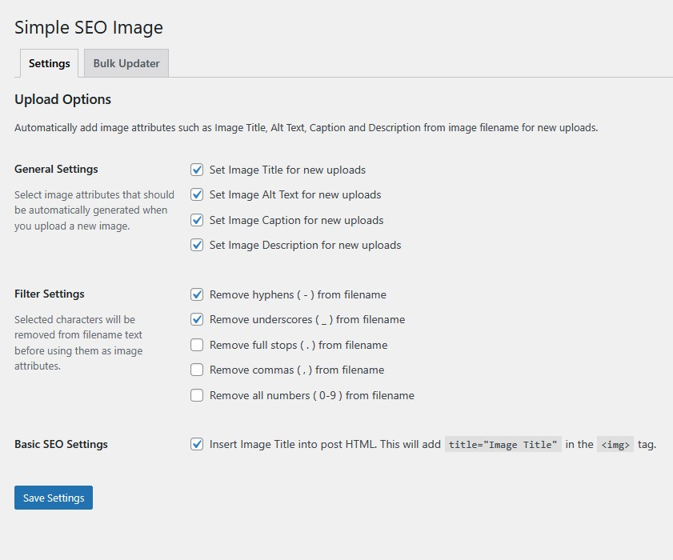
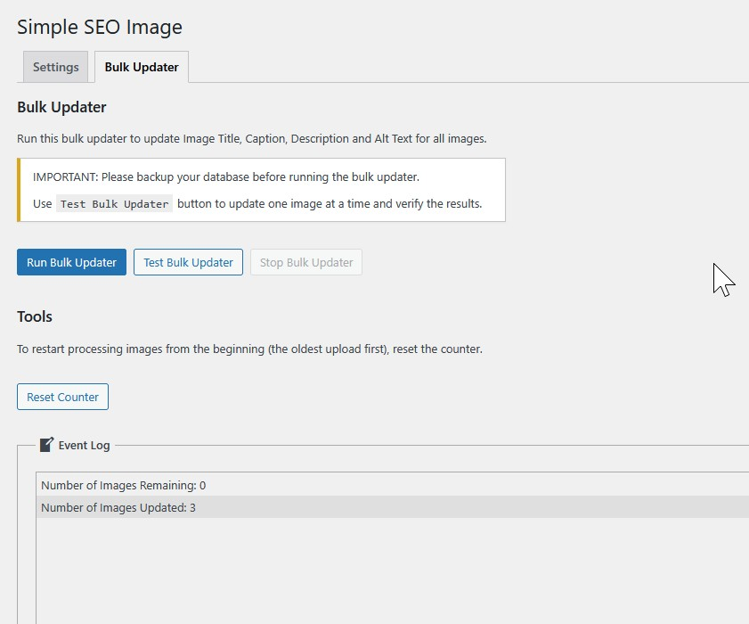

# Simple SEO Image

## Description

Automatically optimize images for SEO by generating alt text, titles, captions, and descriptions from filenames. Improves search rankings and accessibility.

## Features

* Auto-generate image attributes from filenames for new uploads
* Bulk update existing images in Media Library
* Insert title attributes into post HTML
* Filter filename characters (hyphens, underscores, numbers, etc.)
* Works with all WordPress editors (Classic, Gutenberg, etc.)

**Example:** *My_image-name.jpg* becomes *My image name* across all image attributes.

**Bulk Updater:** Update unlimited existing images with one click. **Always backup your database first.**

Configure in Settings > Simple SEO Image.

## Screenshots

*The settings page in Settings > Simple SEO Image*

*The Bulk Updater screen*

## Installation

To install this plugin:

1. Install the plugin through the WordPress admin interface, or upload the plugin folder to /wp-content/plugins/ using ftp.
2. Activate the plugin through the 'Plugins' screen in WordPress.
3. Go to WordPress Admin > Settings > Simple SEO Image.

## Frequently Asked Questions

### Will this plugin update existing images in the media library?

Yes, the plugin will update image Title, Caption, Description And Alt Text from the image filename for both existing images in the media library and new uploads.

### How does the bulk updater work?

The bulk updater processes all images in your media library one by one, generating SEO-friendly attributes from their filenames. Always backup your database before running the bulk updater.

## Changelog

### 1.0.0
* Initial release of Simple SEO Image
* Auto-generate image attributes from filenames for new uploads
* Bulk update existing images in Media Library
* Insert title attributes into post HTML
* Filter filename characters (hyphens, underscores, numbers, etc.)
* WordPress 6.8 compatibility